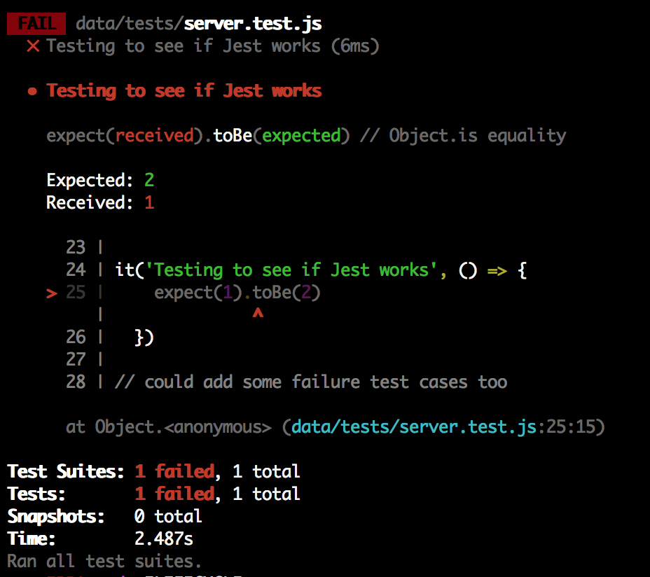
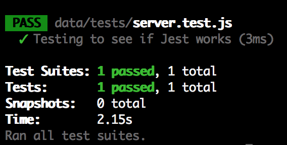

### Writing your first test
Ok this is the exciting bit! We get to write our first test!!

A few things before we get stuck in, Jest has 3 words that you can use:
- `describe` : this lets you wrap a bunch of related tests together, it's used for organising test (we don't need to worry about it for now).
- `it` : lets you run a test. We need this in every test!
- `expect` : lets you write assertions. The tests pass if the assertions pass.


NB: An **assertion** is the validation step in testing. It is the step that compares your actual results with the expected outcome. For a test to pass, the actual results and the expected outcome need to be equal, meaning your assertion is true.


Dont' worry this will all make sense when we start writing some tests.

In your `server.test.js` file we can write an example of a failing test. Go ahead and write the following in your `server.test.js` file:

```
it('Testing to see if Jest works', () => {
  expect(1).toBe(2)
})
```
This test will fail as 1 does not equal 2.

### Running your tests
To run your tests just run `npm run test` on the command line.

You should see something like this:




Now to make those tests pass, change your code to
```
it('Testing to see if Jest works', () => {
  expect(1).toBe(1)
})
```

Now run the test again, `npm run test`



Wooohoo! A passing test! Let's move onto the next step.